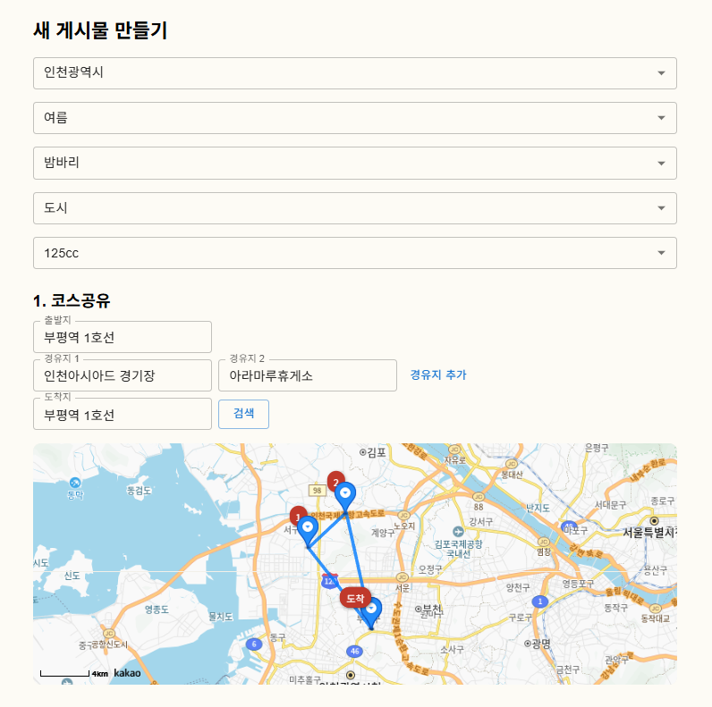
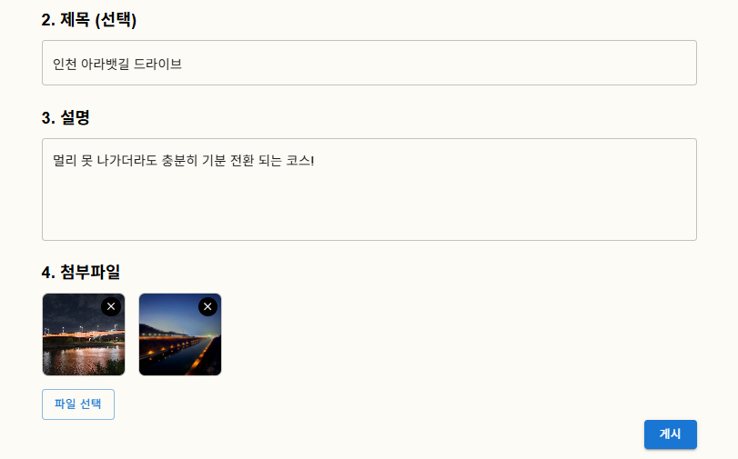
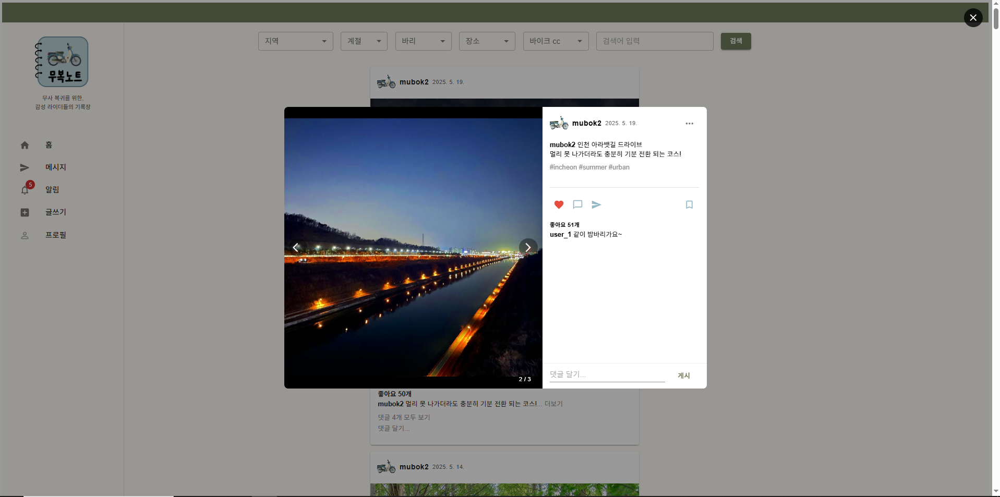

# 🛵 무복노트 (MUBOKNOTE)

> **“무사 복귀를 위한, 감성 라이더들의 기록장”**

  

---

## 1. 📌 프로젝트 주제  
**React를 활용한 감성 라이더 전용 SNS 만들기**

---

## 2. 💡 프로젝트 소개  
**무복노트(MUBOKNOTE)**는 이륜차 라이더들이 드라이브 코스를 공유하고 기록할 수 있는 감성 SNS입니다.  
영상이 아닌 지도 기반으로 경로를 시각화하고, 경유지, 계절, 풍경 정보를 공유합니다.  
기존 유튜브 중심의 정보 제공 방식에서 벗어나, 라이더 관점에서 필요한 정보를 중심으로 구성했습니다.

---

## 3. 🎯 기획 배경

| ❓ 불편했던 점 | ✅ 무복노트의 해결 방식 |
|----------------|--------------------------|
| 이륜차 전용 여행 정보 부족 | 경로, 도로 정보 중심의 코스 공유 |
| 도로 특성 파악 어려움 | 포장 상태, 곡선/직선 여부 등 태그화 |
| 비사교적 라이더의 정보 접근 장벽 | 개방형 SNS 구조 + 검색/필터 제공 |
| 영상 중심 정보의 비효율성 | 지도 기반 시각화 및 경유지 중심 설명 |

---

## 4. ⏱️ 개발 기간  
**2025.05.07 ~ 2025.05.15 (1주간)**

---

## 5. 🛠 사용 기술

| 분류 | 기술 |
|------|------|
| Frontend | React, MUI |
| Backend | Node.js, Express |
| Database | MySQL |
| 기타 | KakaoMap API, JWT, Bcrypt |

---

## 6. 📄 페이지별 주요 기능

### 🚩 1. 피드 / 코스 등록  
- 출발지 / 경유지 / 도착지 입력 시 **경로(polyline) 자동 생성** (KakaoMap API 연동)  
- 사진, 설명, 계절, 난이도, 태그 입력 가능  

  

  

---

### 🖼️ 2. 피드 리스트 & 상세 보기  
- 이미지 슬라이더 + 지도 기반 polyline 표시  
- 좋아요 / 댓글 기능  
- 내가 작성한 피드 수정 및 삭제  
- 피드 수정 시 기존 코스 자동 불러오기  

  

  

  

---

### 🏁 메인 페이지  

  

---

### 🔐 로그인 / 회원가입  

  
  

---

### 🔍 3. 검색 및 필터 *(예정)*  
- 거리, 시간, 계절, 도로 유형, 지역 등 조건 필터링  
- 키워드 기반 피드 검색  

---

### 👤 4. 프로필 페이지 *(예정)*  
- 내가 작성한 피드 리스트  
- 내가 북마크한 코스(피드) 목록  

---

### 💬 5. 채팅 기능 *(예정)*  
- 1:1 채팅방 생성  
- 실시간 메시지 송수신 (Socket.io 기반 예정)  

---

### 🔔 6. 알림 기능 *(예정)*  
- 새로운 댓글, 좋아요, 채팅 도착 알림  

---

## 7. ✨ 프로젝트 후기

### 👍 좋았던 점
- 이전 팀 프로젝트에서 사용하지 못했던 KakaoMap API를 집중적으로 다룰 수 있었음  
- 개인 취미와 밀접한 주제로, 직접 필요한 기능을 기획하고 반영할 수 있었음  
- Vue.js와 달리 React의 컴포넌트 중심 개발 방식을 직접 체험하고 비교할 수 있었음  

### 😢 아쉬웠던 점
- 약 일주일이라는 짧은 개발 기간  
- 지도 API를 다양한 페이지에 적용하며 예상치 못한 오류 처리에 시간 소요  
- 계획했던 기능의 절반 정도만 완성된 점

---
